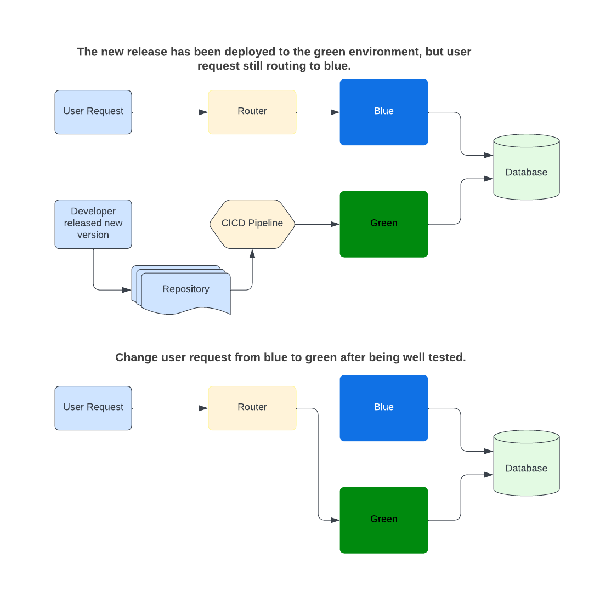

# blue-green-cicd-architecture
Complete deployment process with CI/CD automation including blue/green deployment policy

## What is a blue-green deployment?
Blue/green deployment is a software deployment approach that helps organizations deploy frequent updates while maintaining high quality and a smooth user experience.A blue-green deployment uses two production environments (known as Blue and Green) to provide reliable testing, continuous no-outage releases, and instant rollbacks.At any given time, only one of the production environments is live. 

The Blue environment, for example, receives all user traffic while the clone (Green) remains idle. When a new version of the application is ready for release, it is deployed to the Green environment for testing. Once the release passes testing, the application traffic is routed from Blue to Green. The Green environment becomes the new production environment, and the Blue goes idle.

<kbd></kbd>